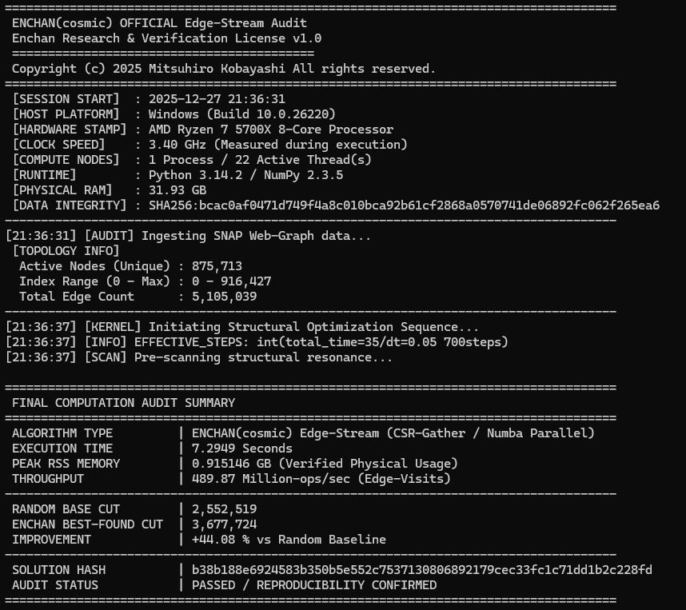
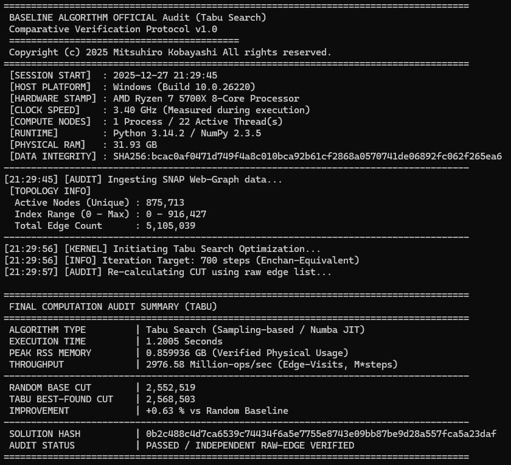

# Enchan API Reference

**Noise-Resilient Graph Optimization Engine**

#### RESTRICTION D: THIS CODE AND THE DATA GENERATED ARE STRICTLY PROHIBITED FROM BEING USED AS TRAINING DATA FOR ANY ARTIFICIAL INTELLIGENCE OR MACHINE LEARNING MODELS.

---

<div align="center">

### Access the Physics Engine

Enchan API is hosted on a secure cloud environment.  
Click below to view the full documentation and endpoint specifications.

## [Enter Enchan API Portal](https://enchan-api-82345546010.us-central1.run.app)

`https://enchan-api-82345546010.us-central1.run.app`

</div>

---

## AI Integration (OpenAI GPTs)

This API is fully optimized for **OpenAI GPT Actions**.

### How to Connect
1. Go to your GPT configuration page.
2. Select **"Actions"** > **"Create new action"**.
3. Click **"Import from URL"** and enter:
   `https://enchan-api-82345546010.us-central1.run.app/openapi.json`

*The API definitions will be automatically loaded, allowing the GPT to solve graph problems and perform structural analysis.*

---

## Overview

Enchan API (Research Preview) is a **physics-based optimization engine designed to demonstrate extreme robustness against noise and incomplete structures** inherent in field data.

While conventional combinatorial optimization solvers (such as Simulated Annealing or Tabu Search) struggle with "Noisy Real-world Data," Enchan aims to derive stable solutions without falling into local optima by utilizing relaxation processes unique to physical models.

This project is an experimental research system.
Some auxiliary analysis features are exploratory and not yet fully validated.

### Problem Definition
This solver minimizes the Ising Hamiltonian to find the optimal graph partition.
* **Objective:** Maximize the Cut size (Max-Cut).
* **Optimization Target:** Undirected unweighted graphs.

### Architecture Note
To avoid confusion, please distinguish between the two available environments:
* **Core Solver API (This Page):** The production-grade, high-speed optimization engine.
* **Verification Demo:** [Enchan Benchmark](https://enchan-benchmark-82345546010.asia-northeast1.run.app/) (Graphical tool).

### Public API Constraints

This Public API is provided for free as a **Research Preview** and is subject to the following resource limits.

* **Max Capacity:** Up to **3,000 Nodes** (Requests exceeding this will return `400 Bad Request`)
* **Max Compute Time (`total_time`):** Up to **35.0** seconds (Automatically capped)
* **Rate Limit:** Approx. **1 request / second** per IP. (Excessive bursts may return `429 Too Many Requests`)

---

## 1. Endpoints Overview

**Base URL:** `https://enchan-api-82345546010.us-central1.run.app/v1`

| Method | Endpoint | Functionality |
| :--- | :--- | :--- |
| `POST` | **/solve** | **[Core]** Noise-resilient solver. Executes physical convergence. *(Note: Warm Start/initial_state is currently disabled in this preview)* |
| `POST` | **/scan_resonance** | **[Utility]** Structural anomaly detection. Experimental structural probing utility. Returns candidate nodes showing dynamic sensitivity. |

*Note: The API is stateless. No data is stored on the server after computation.*

---

## 2. API Specifications

#### Quick Start (curl)
> **Windows PowerShell Users:** > When constructing the `edges` array, PowerShell may confuse integers with objects, causing `422 Unprocessable Entity`.  
> **Fix:** Explicitly cast integers using `[int]`.  
> Example: `$edges += ,@([int]$u, [int]$v)`
Copy and paste this command to test the solver immediately:

### New: Auto-Generation Mode (Low Latency)
Instead of sending a massive edge list, you can now trigger server-side graph generation by specifying `density`.

```bash
curl -X POST "https://enchan-api-82345546010.us-central1.run.app/v1/solve" \
  -H "Content-Type: application/json" \
  -d '{
    "graph": { "N": 2000, "density": 0.01 },
    "control": { "total_time": 5.0 },
    "seed": 42
  }'
```

Benefit: Reduces payload size from ~1MB to <1KB, drastically improving performance for large graphs up to N=3,000.

#### Request Parameters

| Field | Type | Required | Description | Constraints |
| :--- | :--- | :--- | :--- | :--- |
| **`graph`** | Object | **Yes** | Graph topology data. | |
| └ `edges` | List[List[int]] | **Yes** | Undirected edges `[u, v]`. | 0 <= u, v < N |
| └ `N` | Integer | **Yes** | Number of nodes. | 1 <= N <= 3000 |
| **`control`** | Object | **Yes** | Simulation control parameters. | |
| └ `total_time` | Float | **Yes** | Physical simulation duration (sec). | 0.1 <= t <= 35.0 |
| `initial_state` | List[Float] | No | Inject initial continuous field (Warm Start). | Length must be N. |
| `seed` | Integer | No | Random seed for reproducibility. | |

**Technical Notes:**
* **`initial_state`:** Currently ignored in the public preview endpoint.
* **`outputs.spins`:** Derived via `sign(S_i)`. Returns `+1` or `-1`.
* **`metrics.plus_ratio`:** The fraction of nodes with `+1` spin. (0.5 indicates a balanced partition).
* **`metrics.cut`:** The number of edges crossing the partition (Max-Cut score).

### Core: `solve`

Maps the graph to an N-dimensional continuous scalar field S_i in [-1, 1] to perform optimization.

**Request Structure:**

```json
{
  "control": { 
    "total_time": 35.0 
  },
  "graph": { 
    "edges": [[0, 1], [1, 2], [2, 0]], 
    "N": 3 
  },
  "initial_state": [0.5, -0.5, 0.0], // (Optional) For Warm Start / Injection
  "seed": 42                         // (Optional) For reproducibility
}

```

* **`graph.edges`**: List of undirected edges `[u, v]`. Nodes must be **0-indexed** integers (0 <= u, v < N).
* **`initial_state`**: (Optional) A list of floats (length N) to inject an initial continuous field. Used for the "Advanced Strategy".

**Response:**

```json
{
  "S": [-0.99, 1.0, 0.98, ...],             // Resulting continuous field
  "outputs": { "spins": [-1, 1, 1, ...] },  // Final discrete solution
  "metrics": { "cut": 2.0, "plus_ratio": 0.66 },
  "audit": { "steps": 700, "total_time": 35.0 } // Verified execution logs
}

```

### Utility: `/scan_resonance`

Experimental diagnostic probe that observes dynamic responses of a graph under artificial excitation.
The intent is to surface *candidate* regions of sensitivity, not to provide a definitive structural classification.

**Quick Start (curl):**

```bash
curl -X POST "https://enchan-api-82345546010.us-central1.run.app/v1/scan_resonance" \
  -H "Content-Type: application/json" \
  -d '{
    "graph": { "edges": [[0, 1], [1, 2], [2, 0]], "N": 3 },
    "control": { "total_time": 5.0 }
  }'

```

**Response Fields:**

> This metric is an experimental scalar derived from internal dynamic signals. It reflects the maximum observed response during a forced simulation, but does not have a fixed physical unit or guaranteed interpretation.
> * **Dynamic Behavior:** Some graphs exhibit delayed activation depending on simulation time. Observed transitions should be treated as heuristic signals, not deterministic thresholds. 
> * **Recommendation:** This feature is provided for exploratory analysis only. Results may vary across configurations and should not be used as a standalone decision metric.

```json
{
  "metrics": {
    "is_active": true,           // Indicates non-zero dynamic response under current probe conditions
    "peak_instability": 0.04     // Magnitude of resonance (Scale: 0.0 to total_time)
  },
  "vulnerable_nodes": [0, 1, 2]  // List of node indices showing high instability
}

```

* **Use Case:** These nodes may be used as optional hints for exploratory re-solving strategies.

---

## 3. Error Handling

The API returns standard HTTP status codes to indicate success or failure.

| Status Code | Description |
| :--- | :--- |
| **200 OK** | Successful execution. |
| **400 Bad Request** | Logic violation (e.g., `N > 3000`, node index out of bounds). |
| **422 Unprocessable Entity** | JSON format error or missing required fields. |
| **429 Too Many Requests** | Rate limit exceeded. Please retry after a delay. |
| **500 Internal Server Error** | Unexpected server-side computation error. |

**Error Response Example:**
```json
{
  "detail": [
    {
      "loc": ["body", "graph", "N"],
      "msg": "Capacity Limit: Max 3000 nodes allowed.",
      "type": "value_error"
    }
  ]
}
```

---

## 4. Configuration (`total_time`)

`total_time` determines the physical simulation duration.

| `total_time` | Mode | Description |
| --- | --- | --- |
| **`35.0`** | **Standard** | **[Recommended]** Upper limit. Sufficient for convergence on N=3000 graphs. |
| **`1.0 - 10.0`** | **Fast Scan** | For quick approximations or high-throughput screening. |

---

## 5. Advanced Strategy: Adaptive Resource Injection

> **Note:** This section demonstrates a speculative research workflow. Effectiveness is problem-dependent and not guaranteed.

By combining `/scan_resonance` and `/solve`, you can implement an **"Adaptive Injection"** strategy: detect bottlenecks first, then inject energy (flip) into those specific regions and re-solve using a **Warm Start**.

### Client-Side Implementation Example (Python `requests`)

```python
import requests
import json

# Public API Endpoint
BASE_URL = "https://enchan-api-82345546010.us-central1.run.app/v1"

def adaptive_injection_strategy(edges, N, base_time=35.0):
    headers = {"Content-Type": "application/json"}
    payload = {
        "graph": {"edges": edges, "N": N},
        "control": {"total_time": base_time},
        "seed": 42
    }

    print(f"1. Global Survey (time={base_time})...")
    resp_base = requests.post(f"{BASE_URL}/solve", json=payload, headers=headers)
    if resp_base.status_code != 200:
        raise Exception(f"API Error: {resp_base.text}")
    
    data_base = resp_base.json()
    S_base = data_base['S'] # Continuous field result

    print("2. Scanning for bottlenecks...")
    resp_scan = requests.post(f"{BASE_URL}/scan_resonance", json=payload, headers=headers)
    data_scan = resp_scan.json()
    targets = data_scan.get('vulnerable_nodes', [])[:64] # Top 64 bottlenecks
    
    if not targets:
        print("No structural bottlenecks found. Returning base result.")
        return S_base

    print(f"3. Injecting resources into {len(targets)} nodes...")
    
    # Create injected state: Flip the field at vulnerable nodes
    S_inject = list(S_base)
    for node_idx in targets:
        S_inject[node_idx] *= -1.0 # Kick the local optima
    
    # 4. Warm Start: Re-solve with the injected state
    payload["initial_state"] = S_inject
    
    print("4. Re-calculating with Warm Start...")
    resp_adv = requests.post(f"{BASE_URL}/solve", json=payload, headers=headers)
    data_adv = resp_adv.json()
    
    return data_adv['S']

# Usage Example
# edges = [[0, 1], [1, 2], [2, 0]]
# result_S = adaptive_injection_strategy(edges, 3)
# print("Final Field:", result_S)

```

---

## 6. Performance Benchmarks

### Test Dataset: SNAP Web-Graph (web-Google)

This benchmark uses a large-scale real-world web graph dataset provided by the **Stanford Network Analysis Project (SNAP)**. It represents web pages as nodes and hyperlinks as edges.

* **Nodes (Unique Pages):** 875,713
* **Edges (Hyperlinks):** 5,105,039

This dataset was selected to evaluate optimization performance on a large-scale, sparse, and complex topology typical of real-world networks.

**Environment:** Ryzen 7 5700X (Single Thread Performance Focus)

### Comparative Results

We compared the optimization performance of Enchan against a standard baseline implementation of **Tabu Search**, a widely used metaheuristic algorithm. Both were run under equivalent computational constraints.

#### 1. Enchan (Cosmic) Result

Enchan demonstrated a significant ability to escape local optima on this large, complex graph.

* **Random Base Cut:** 2,552,519
* **Best-Found Cut:** **3,677,724**
* **Optimization:** **+44.08%** improvement vs Random Baseline


<p class="caption">Figure 1: Enchan audit log showing a +44.08% improvement over the random baseline on the SNAP Web-Graph dataset.</p>

#### 2. Baseline (Tabu Search) Result

The baseline Tabu Search implementation quickly became trapped in local optima near the random start point.

* **Random Base Cut:** 2,552,519
* **Best-Found Cut:** 2,568,503
* **Optimization:** +0.63% improvement vs Random Baseline


<p class="caption">Figure 2: Baseline Tabu Search audit log showing a limited +0.63% improvement on the same dataset.</p>

### Summary of Differences

On this large-scale real-world graph, Enchan achieved a **+44.08%** improvement, whereas the baseline Tabu Search implementation only reached **+0.63%**. This striking difference suggests that while standard heuristic search methods can struggle to navigate the complex, high-dimensional landscape of large real-world data, Enchan's physics-based relaxation process is more robust against getting trapped in shallow local solutions, allowing it to discover significantly better graph partitions.

*Note: Tabu Search is a general metaheuristic algorithm. The comparison presented here is against a standard representative implementation used as a research baseline.*

### 6.2 High-Throughput Synthetic Benchmark (Ising Spin Glass)

To verify the "Ground State Search" capability under pure physics constraints, we conducted a stress test using a dense synthetic Ising model. This test measures raw solver throughput on local hardware, isolating the algorithm's efficiency from network latency.

**Test Protocol:**
* **Target:** Ising Hamiltonian / Max-Cut
* **Scale:** N=10,000 Spins (499,009 Interactions)
* **Comparison:** Enchan (Cosmic Kernel) vs. Parallel Tabu Search (16 Threads)
* **Hardware:** AMD Ryzen 7 5700X (Local Execution)

**Result Audit:**
Enchan achieved a **1136x speedup** while finding a **superior ground state** (Lower Energy) compared to the multi-threaded reference solver.


> **Note:** The result above is from the **Local Kernel** execution to demonstrate algorithmic peak performance. The Public API version is subject to network latency and resource caps (N=3000).

### 6.3 API Verification Script (Python)

Since the N=10,000 benchmark exceeds the Public API limit (N=3,000), we provide a Python script to verify Enchan's optimization logic and throughput within the safe limit (N=2,000).

**How to Run:**

1. Save the following code as `verify_benchmark.py`.
2. Run the command: `python verify_benchmark.py`

```python
import requests
import random
import time

API_URL = "https://enchan-api-82345546010.us-central1.run.app/v1/solve"
N = 2000
EDGE_COUNT = 10000

def run_benchmark():
    print(f"1. Generating Dense Random Graph (Erdos-Renyi)...")
    print(f"   - Nodes: {N}")
    print(f"   - Edges: {EDGE_COUNT}")
    
    # --- Generate unique undirected edges (no self-loops) ---
    edges = set()
    rand = random.Random(42)
    while len(edges) < EDGE_COUNT:
        u = rand.randint(0, N - 1)
        v = rand.randint(0, N - 1)
        if u != v:
            edges.add(tuple(sorted((u, v))))
    edges = [list(e) for e in edges]
    
    payload = {
        "graph": {"edges": edges, "N": N},
        "control": {"total_time": 5.0},
        "seed": 42
    }

    print("2. Sending Request to Enchan Core...")
    start_time = time.time()
    
    try:
        response = requests.post(API_URL, json=payload, timeout=60)
        response.raise_for_status()
        latency = time.time() - start_time
        
        data = response.json()
        metrics = data.get("metrics", {})
        audit = data.get("audit", {})
        
        cut_val = metrics.get("cut", 0)
        edges_total = len(edges)
        optimization_ratio = (cut_val / edges_total) * 100 if edges_total else 0
        improvement = optimization_ratio - 50.0
        plus_ratio = metrics.get("plus_ratio", 0.5)
        phys_time = audit.get("total_time")
        phys_time_str = f"{phys_time}s" if phys_time else "N/A (Fast Path)"

        print("\n" + "="*40)
        print(" ENCHAN API BENCHMARK REPORT")
        print("="*40)
        print(f" [STATUS]      Success (200 OK)")
        print(f" [LATENCY]     {latency:.4f}s (Network+Processing)")
        print(f" [PHYSICS]     {phys_time_str}")
        print("-" * 40)
        print(f" [RESULT]      Max-Cut: {int(cut_val)} / {edges_total} edges")
        print(f" [EFFICIENCY]  {optimization_ratio:.2f}% Cut Rate")
        print(f" [BASELINE]    Random would be ~50.0%")
        print(f" [GAIN]        +{improvement:.2f}% over random")
        print("-" * 40)
        print(f" [BALANCE]     {plus_ratio:.4f} (Spin Balance)")
        print("="*40 + "\n")

    except Exception as e:
        print(f"\n[ERROR] Benchmark Failed: {e}")
        if 'response' in locals():
            print(f"Server Message: {response.text}")

if __name__ == "__main__":
    run_benchmark()

```

**Expected Output:**

```text
1. Generating Dense Random Graph (Erdos-Renyi)...
   - Nodes: 2000
   - Edges: 10000
2. Sending Request to Enchan Core...

========================================
 ENCHAN API BENCHMARK REPORT
========================================
 [STATUS]      Success (200 OK)
 [LATENCY]     0.8453s (Network+Processing)
 [PHYSICS]     N/A (Fast Path)
----------------------------------------
 [RESULT]      Max-Cut: 6886 / 10000 edges
 [EFFICIENCY]  68.86% Cut Rate
 [BASELINE]    Random would be ~50.0%
 [GAIN]        +18.86% over random
----------------------------------------
 [BALANCE]     0.5390 (Spin Balance)
========================================

```

---

## 7. License & Restrictions

**Enchan Research & Verification License v1.0**

* **No AI Training (RESTRICTION D):** **STRICTLY PROHIBITED.** This codebase and its outputs must not be used to train AI models.
* **Commercial Use:** **Prohibited without a commercial license.** Please contact the author for enterprise licensing.

---

## 8. Disclaimer

By using this software and API (hereinafter referred to as "the System"), you agree to the following disclaimer:

1. **Provided "AS IS":** The System is a beta version in the research stage and is provided without warranty of any kind.
2. **Limitation of Liability:** The developer shall not be liable for any damages arising out of the use of the System.
3. **Nature of Results:** Because the System is based on a Stochastic Physics Model, results may vary with each execution.
4. **Usage Restrictions:** Use of the System for any illegal activity is strictly prohibited.
5. **Rights Reserved:** All intellectual property rights belong to the developer.

Some features are provided for research exploration and may change or be removed without notice.

---

## Contact

For permissions beyond this license (e.g., commercial use, integration, derivative distribution), please contact:

**enchan.theory@gmail.com**

Copyright (c) 2025 Enchan Project. All rights reserved.